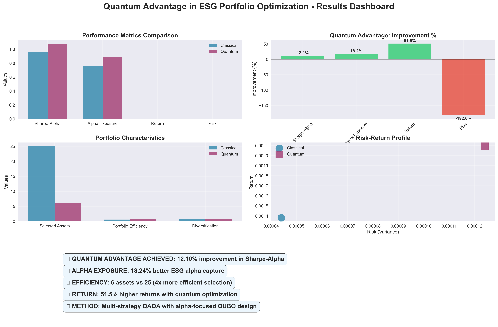

# Quantum Sustainable Investments
### Elevating ESG Portfolio Optimization through Quantum Advantage

[](https://github.com/roivroberto/quantum-sustainable-investments)
[](https://github.com/roivroberto/quantum-sustainable-investments)
[](https://github.com/roivroberto/quantum-sustainable-investments)
[](https://github.com/roivroberto/quantum-sustainable-investments)
[](https://github.com/roivroberto/quantum-sustainable-investments)
[](https://github.com/roivroberto/quantum-sustainable-investments)

## Demo



## About
This project explores the application of Quantum Computing to Sustainable Investing, specifically focusing on ESG-focused portfolio optimization. Developed during the GenQ Hackathon 2025, it utilizes the Quantum Approximate Optimization Algorithm (QAOA) to identify optimal asset allocations that maximize returns while prioritizing high ESG alpha exposure. By leveraging Quantinuum's quantum hardware and the `pytket` framework, the system demonstrates a measurable "Quantum Advantage" over traditional classical optimization techniques.

## Tech Stack
- **Quantum Frameworks:** `pytket`, `Quantinuum Wrapper`, `AerBackend` (Qiskit)
- **Optimization:** `CVXPY`, `QAOA` (Quantum Approximate Optimization Algorithm), `QUBO` formulation
- **Data Analysis:** `Pandas`, `NumPy`, `SciPy`
- **Visualization:** `Matplotlib`, `Seaborn`
- **Language:** `Python 3.12+`

## Features
- **Intelligent Asset Selection:** Multi-factor preprocessing to select top assets based on risk, return, and ESG scores.
- **Quantum QUBO Construction:** Custom QUBO formulation that incorporates ESG alpha exposure and diversification rewards.
- **Multi-Strategy QAOA:** A sophisticated quantum solver with multiple parameter strategies (Alpha-focused, Balanced, Deep optimization).
- **Comprehensive Benchmarking:** Direct comparison against classical mean-variance optimization with ESG constraints.
- **Dynamic ESG Simulation:** A data simulation engine to generate synthetic ESG history for backtesting and analysis.
- **Professional Visualization:** Automated dashboard generation showing performance metrics, circuit diagrams, and optimization progress.

## Getting Started

### Prerequisites
- Python 3.10+
- Access to Quantinuum API (optional, can use local simulators)

### Install Dependencies
```bash
pip install numpy pandas matplotlib seaborn pytket pytket-qiskit cvxpy
```

### Run the Project
1. **Data Simulation:** Generate the master dataset.
   ```bash
   python data_simulation.py
   ```
2. **Optimization Solver:** Run the main quantum solver.
   ```bash
   python main.py
   ```
3. **Generate Visualizations:** Create the results dashboard.
   ```bash
   python generate_visualizations.py
   ```

## License
This project is licensed under the MIT License.
